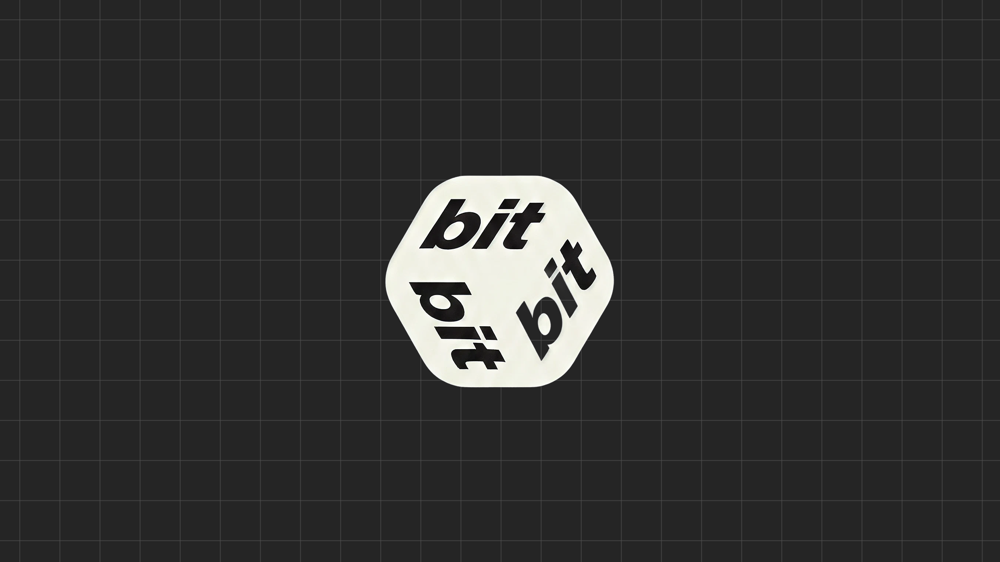

<p align="center">
  
</p>

<p align="center">
  <strong>The <code>.bit</code> language toolkit</strong> — parse, validate, render, store, and convert structured documents.
</p>

<p align="center">
  <a href="https://github.com/zaius-labs/dotbit/actions"></a>
  <a href="https://crates.io/crates/bit-lang-core"></a>
  <a href="https://www.npmjs.com/package/bit-lang"></a>
  <a href="https://pypi.org/project/bit-lang/"></a>
  <a href="LICENSE"></a>
</p>

---

## What is .bit?

`.bit` is a structured document language for defining **entities**, **tasks**, **flows**, and **schemas**. Think of it as a middle ground between Markdown (human-readable) and JSON (machine-processable) — with first-class support for state machines, typed schemas, and ternary validation.

```bit
# Project Setup

define:@User
    name: ""!
    email: ""!
    role: :admin/:editor/:viewer!

mutate:@User:alice
    name: "Alice Chen"
    email: "alice@example.com"
    role: :admin

## Tasks
    [x] Define user schema
    [!] Add authentication flow
    [!] Write API endpoints :@alice

    flow:onboarding
        draft --> review --> approved
```

### Why .bit?

| Feature | JSON | YAML | TOML | Markdown | **.bit** |
|---------|------|------|------|----------|----------|
| Human-readable | No | Yes | Yes | Yes | **Yes** |
| Typed schemas | No | No | No | No | **Yes** |
| Entity definitions | No | No | No | No | **Yes** |
| Task tracking | No | No | No | Partial | **Yes** |
| State machines | No | No | No | No | **Yes** |
| Ternary validation | No | No | No | No | **Yes** |
| File-native editing | Yes | Yes | Yes | Yes | **Yes** |
| Round-trips cleanly | Yes | Mostly | Yes | No | **Yes** |

---

## Install

### CLI

```sh
# Cargo
cargo install bit-lang-cli

# Homebrew (coming soon)
brew install zaius-labs/tap/bit-lang
```

### Rust Library

```toml
[dependencies]
bit-lang-core = "0.1"
```

### JavaScript / TypeScript (WASM)

```sh
npm install bit-lang
```

### Python

```sh
pip install bit-lang
```

---

## Quick Start

### 1. Create a .bit file

```sh
bit init my-project
cd my-project
```

This creates a starter project with `schema.bit` (the language reference, embedded in every bitstore as `@_system:schema`).

### 2. Define entities and tasks

Create `users.bit`:

```bit
# Users

define:@User
    name: ""!
    email: ""!
    role: :admin/:editor/:viewer!
    active: true?

mutate:@User:alice
    name: "Alice Chen"
    email: "alice@example.com"
    role: :admin

mutate:@User:bob
    name: "Bob Smith"
    email: "bob@example.com"
    role: :editor

## Onboarding
    [x] Set up user schema
    [!] Add authentication flow
    [!] Write API endpoints
```

### 3. Parse and explore

```sh
# Parse to JSON AST
$ bit parse users.bit | jq '.nodes | length'
4

# Format with consistent style
$ bit fmt users.bit --write

# Validate against schema
$ bit validate users.bit

# Convert JSON to .bit
$ echo '{"Product": {"name": "Widget", "price": 9.99}}' | bit convert - --from json
define:@Product
    name: "Widget"
    price: 9.99
```

### 4. Store and expand

```sh
# Pack .bit files into a compressed store
$ bit collapse ./my-project
Collapsed 3 files into my-project.bitstore

# Expand back to editable files
$ bit expand my-project.bitstore --output ./working
Expanded 3 files to ./working

# Check for drift
$ bit status my-project.bitstore ./working
No changes
```

---

## Architecture

```
┌─────────────────────────────────────────────────────┐
│                   bit-lang ecosystem                 │
├─────────────┬───────────┬───────────┬───────────────┤
│  bit-lang   │ bit-lang  │ bit-lang  │  your app     │
│  cli (bit)  │ (PyO3)    │ (WASM)    │  (Rust lib)   │
├─────────────┴───────────┴───────────┴───────────────┤
│                  bit-lang-core (Rust)                │
│  ┌────────┐ ┌────────┐ ┌──────────┐ ┌────────────┐ │
│  │ Parser │ │   IR   │ │Interpret │ │  Validate  │ │
│  │  5.7K  │ │  1.4K  │ │   0.7K   │ │    1.0K    │ │
│  └────┬───┘ └────┬───┘ └────┬─────┘ └─────┬──────┘ │
│  ┌────┴───┐ ┌────┴───┐ ┌────┴─────┐ ┌─────┴──────┐ │
│  │ Lexer  │ │ Schema │ │  Gates   │ │  Checks    │ │
│  │  0.6K  │ │  0.4K  │ │  0.7K    │ │    1.1K    │ │
│  └────────┘ └────────┘ └──────────┘ └────────────┘ │
│  ┌────────┐ ┌────────┐ ┌──────────┐ ┌────────────┐ │
│  │ Render │ │ Format │ │  Query   │ │  Convert   │ │
│  │  1.3K  │ │  1.1K  │ │  0.5K    │ │   (J/M/T)  │ │
│  └────────┘ └────────┘ └──────────┘ └────────────┘ │
├─────────────────────────────────────────────────────┤
│              bit-lang-store                          │
│                                                     │
│  ┌─────────────────────────────────────────────┐    │
│  │         Page-Based Database Engine           │    │
│  │                                             │    │
│  │  ┌───────┐ ┌────────┐ ┌──────┐ ┌────────┐  │    │
│  │  │ Pager │ │ B-Tree │ │Tables│ │ Query  │  │    │
│  │  │ cache │ │ search │ │entity│ │ engine │  │    │
│  │  │ flush │ │ insert │ │task  │ │ filter │  │    │
│  │  │ free  │ │ delete │ │flow  │ │ sort   │  │    │
│  │  │ list  │ │ scan   │ │blob  │ │ limit  │  │    │
│  │  └───────┘ └────────┘ └──────┘ └────────┘  │    │
│  │                                             │    │
│  │  4KB pages · B-tree indexes · blake3 hashes │    │
│  │  Single file · Zero config · Instant queries│    │
│  └─────────────────────────────────────────────┘    │
│                                                     │
│  ┌─────────────────────────────────────────────┐    │
│  │         Store Intelligence (zero-dep)        │    │
│  │                                             │    │
│  │  schema inference · predictive autocomplete  │    │
│  │  drift detection · NL queries · BM25 search  │    │
│  │  entity linking · pattern detection          │    │
│  │  schema evolution · composite scoring        │    │
│  │                                             │    │
│  │  opt-in: vector search · anomaly · classify  │    │
│  └─────────────────────────────────────────────┘    │
│                                                     │
│  collapse ↔ expand ↔ query ↔ mutate ↔ status       │
└─────────────────────────────────────────────────────┘
```

---

## CLI Reference

### Core Commands

| Command | Description | Example |
|---------|-------------|---------|
| `bit parse <file>` | Parse to JSON AST | `bit parse users.bit \| jq .` |
| `bit parse <file> --ir` | Parse to compiled IR | `bit parse users.bit --ir` |
| `bit fmt <file>` | Format .bit source | `bit fmt users.bit --write` |
| `bit validate <file>` | Validate against schema | `bit validate users.bit --schema schema.bit` |
| `bit render <file>` | Render AST to .bit text | `bit render users.bit` |
| `bit query <expr> <files>` | Query entities | `bit query '@User' *.bit` |
| `bit check <file>` | Run validation checks | `bit check suite.bit` |

### Store Commands

| Command | Description | Example |
|---------|-------------|---------|
| `bit collapse [dir]` | Pack .bit files → .bitstore | `bit collapse ./project` |
| `bit expand <store>` | Unpack .bitstore → files | `bit expand project.bitstore` |
| `bit status <store> [dir]` | Show drift between store and files | `bit status project.bitstore ./` |

### Database Commands

| Command | Description | Example |
|---------|-------------|---------|
| `bit query <store> <expr>` | Query entities in store | `bit query db.bitstore "@User where role=admin"` |
| `bit insert <store> <ref>` | Insert entity into store | `bit insert db.bitstore @User:dave name=Dave` |
| `bit update <store> <ref>` | Update entity fields | `bit update db.bitstore @User:dave role=editor` |
| `bit delete <store> <ref>` | Delete entity from store | `bit delete db.bitstore @User:dave` |
| `bit info <store>` | Show store stats | `bit info db.bitstore` |
| `bit pages <store>` | Show page map | `bit pages db.bitstore` |

### Utility Commands

| Command | Description | Example |
|---------|-------------|---------|
| `bit convert <file>` | Convert JSON/MD → .bit | `bit convert data.json` |
| `bit watch <dir>` | Watch for .bit changes (NDJSON) | `bit watch ./project` |
| `bit apply <dir>` | Apply .bit to detected harness | `bit apply ./config` |
| `bit init [dir]` | Create new .bit project | `bit init my-project` |

All commands support `-` for stdin and output JSON to stdout.

---

## SDK Usage

### Rust

```rust
use bit_core::*;

// Parse
let doc = parse_source("define:@User\n    name: alice").unwrap();

// Render back
let text = render_doc(&doc);

// Format
let formatted = fmt("# Title\n[!] Task").unwrap();

// Convert from JSON
let doc = from_json(r#"{"User": {"name": "alice"}}"#).unwrap();
let bit_text = render_doc(&doc);

// Build index
let idx = build_index(&doc);

// Validate
let schemas = load_schemas(&["define:@User\n    name: \"\"!\n    email: \"\"!"]).unwrap();
let result = validate_doc(&doc, &schemas);
```

### JavaScript / TypeScript

```typescript
import { parse, fmt, fromJson, fromMarkdown, toJson } from 'bit-lang';

// Parse .bit to AST
const doc = parse('define:@User\n    name: alice');

// Format
const formatted = fmt('# Title\n[!] Task');

// Convert
const bitText = fromJson('{"User": {"name": "alice"}}');
const json = toJson('define:@User\n    name: alice');
```

### Python

```python
import bit_lang

# Parse .bit to JSON AST
ast = bit_lang.parse('define:@User\n    name: alice')

# Format
formatted = bit_lang.fmt('# Title\n[!] Task')

# Convert
bit_text = bit_lang.from_json('{"User": {"name": "alice"}}')
json_str = bit_lang.to_json('define:@User\n    name: alice')
```

---

## .bit Language Reference

### Syntax Overview

```
┌─────────────────────────────────────────────┐
│  .bit Document Structure                    │
├─────────────────────────────────────────────┤
│                                             │
│  # Group (depth 1)                          │
│  ## Subgroup (depth 2)                      │
│                                             │
│  [!] Pending task                           │
│  [x] Completed task                         │
│  [o] In-progress task                       │
│  [A!] Labeled task                          │
│                                             │
│  define:@Entity                             │
│      field: value                           │
│      required_field: ""!                    │
│      int_field: 0#                          │
│      float_field: 0.0##                     │
│      bool_field: true?                      │
│      timestamp: ""@                         │
│      enum: :a/:b/:c!                        │
│      list: []                               │
│      json: {}                               │
│      relation: ->@Other                     │
│                                             │
│  mutate:@Entity:id                          │
│      field: new_value                       │
│                                             │
│  flow:name                                  │
│      draft --> review --> approved           │
│                                             │
│  gate:requirement                           │
│      {condition_met}                        │
│                                             │
└─────────────────────────────────────────────┘
```

### Field Sigils

| Sigil | Type | Example |
|-------|------|---------|
| `!` | Required | `name: ""!` |
| `#` | Integer | `count: 0#` |
| `##` | Float | `price: 0.0##` |
| `?` | Boolean | `active: true?` |
| `@` | Timestamp | `created: ""@` |
| `^` | Indexed | `id: ""^` |
| `[]` | List | `tags: []` |
| `{}` | JSON | `meta: {}` |
| `->` | Relation | `owner: ->@User` |

### Task Markers

| Marker | Meaning |
|--------|---------|
| `[!]` | Pending / required |
| `[x]` | Completed |
| `[o]` | In progress |
| `[~]` | Partial / blocked |
| `[A!]` | Labeled (A = label) |

See `schema.bit` (embedded in every bitstore as `@_system:schema`) for the complete grammar specification.

---

## Lesson Book

Comprehensive guides and examples for learning .bit:

- **[Getting Started](learn/01-getting-started.md)** — Install, first .bit file, basic CLI usage
- **[Entities & Schemas](learn/02-entities-and-schemas.md)** — Define typed entities, field sigils, mutations
- **[Tasks & Flows](learn/03-tasks-and-flows.md)** — Task tracking, state machines, flow transitions
- **[Gates & Validation](learn/04-gates-and-validation.md)** — Ternary logic, gate conditions, check suites
- **[Store & Expand](learn/05-store-and-expand.md)** — .bitstore format, pack/unpack workflow
- **[Converting Formats](learn/06-converting-formats.md)** — JSON ↔ .bit, Markdown → .bit, TOML → .bit
- **[Harness Integration](learn/07-harness-integration.md)** — Watch mode, apply to Claude Code and other harnesses
- **[Advanced Patterns](learn/08-advanced-patterns.md)** — Nested entities, computed fields, query expressions
- **[How the Bitstore Engine Works](learn/09-bitstore-engine.md)** — Pages, B-trees, queries: building a database from scratch
- **[Store Intelligence](learn/10-store-intelligence.md)** — Schema inference, drift detection, NL queries, pattern detection, and more

---

## .bitstore Engine

The `.bitstore` file is a **page-based database** — like SQLite for .bit documents. Single file, zero config, instant queries.

```
┌──────────────────── .bitstore ────────────────────┐
│                                                    │
│  Page 0: Header                                    │
│  ┌──────────────────────────────────────────────┐  │
│  │ BITS │ 4096 │ roots: entity,task,flow,    │  │
│  │      │      │ schema,blob │ change_ctr      │  │
│  └──────────────────────────────────────────────┘  │
│                                                    │
│  Pages 1..N: B-tree nodes                          │
│  ┌──────┐ ┌──────┐ ┌──────┐ ┌──────┐             │
│  │entity│ │ task │ │ flow │ │ blob │  ...         │
│  │B-tree│ │B-tree│ │B-tree│ │B-tree│              │
│  └──────┘ └──────┘ └──────┘ └──────┘             │
│                                                    │
│  4KB pages · B-tree indexes · O(log n) lookups     │
└────────────────────────────────────────────────────┘
```

### How it works

- **Collapse** (`bit collapse`): parses every .bit file, extracts entities/tasks/flows/schemas, inserts into B-tree indexes, stores raw file blobs. One file becomes a queryable database.
- **Query** (`bit query store "@User where role=admin"`): seeks B-tree directly — reads ~3 pages instead of decompressing everything.
- **Mutate** (`bit insert/update/delete`): writes directly to the B-tree. No expand-edit-collapse cycle needed.
- **Expand** (`bit expand`): reads blobs from the B-tree, writes .bit files back to disk. Round-trips cleanly.

### Performance

| Operation | Speed | Notes |
|-----------|-------|-------|
| Insert 5,000 entities | 40ms | B-tree with automatic page splitting |
| Single entity lookup | 4μs | ~3 page reads (root → interior → leaf) |
| Scan 5,000 entities | 1.3ms | Leaf chain traversal |
| Collapse 100 .bit files | 36ms | Parse + index + store blobs |

### Features

- Single portable file — copy anywhere, query immediately
- 5 independent B-trees: entities, tasks, flows, schemas, blobs
- Blake3 content hashing for drift detection
- Freelist for space reclamation on delete
- Page cache for repeated reads
- Portable page-based database format

---

## Store Intelligence

bit-lang-store includes built-in intelligence features that work without external dependencies or models. Every feature ships in the base package.

### Zero-Dependency (ships with base package)

| Feature | What it does | CLI |
|---------|-------------|-----|
| **Schema Inference** | Infer field types, required/optional, enums from data | `bit infer store.bitstore @User` |
| **Predictive Autocomplete** | Suggest likely field values based on historical patterns | `bit suggest store.bitstore @User role` |
| **Drift Detection** | Alert when data distributions shift | `bit drift store.bitstore` |
| **Natural Language Query** | "show me active admins" → `@User where role=admin` | `bit query store.bitstore "active admins"` |
| **Self-Organizing Indexes** | Auto-create indexes on frequently-filtered fields | Automatic |
| **Schema Evolution** | Propose migrations when data doesn't match schema | `bit evolve store.bitstore @User` |
| **Entity Linking** | Resolve "alice" → `@User:alice` via aliases and fuzzy match | Built into queries |
| **Pattern Detection** | Spot duplicates, frequency spikes, value clustering | `bit patterns store.bitstore` |
| **BM25 Search** | Full-text keyword search over entity fields | `bit search store.bitstore "auth error"` |
| **Composite Scoring** | Rank by recency + importance + relevance | Built into context_window |
| **Template Compression** | Collapse similar entities into summaries | Programmatic API |

### Feature-Flagged (optional)

| Feature | Flag | Size | What it adds |
|---------|------|------|-------------|
| **Vector Search** | `embeddings` | +23MB | Semantic similarity via MiniLM embeddings |
| **Anomaly Detection** | `ml` | +1MB | Z-score and isolation forest outlier detection |
| **Auto-Classification** | `ml` | +1MB | Naive Bayes auto-tagging on insert |

```sh
# Base: all zero-dep features included
cargo add bit-lang-store

# With ML classification + anomaly detection
cargo add bit-lang-store --features ml

# With semantic embeddings
cargo add bit-lang-store --features embeddings

# Everything
cargo add bit-lang-store --features full
```

---

## Contributing

```sh
git clone https://github.com/zaius-labs/dotbit
cd dotbit
cargo test --workspace
```

See [CONTRIBUTING.md](CONTRIBUTING.md) for guidelines.

## License

MIT — see [LICENSE](LICENSE).

## Links

- [GitHub](https://github.com/zaius-labs/dotbit)
- [crates.io](https://crates.io/crates/bit-lang-core)
- [npm](https://www.npmjs.com/package/bit-lang)
- [PyPI](https://pypi.org/project/bit-lang/)
- [Language Spec](crates/bit-core/src/schema.bit)
